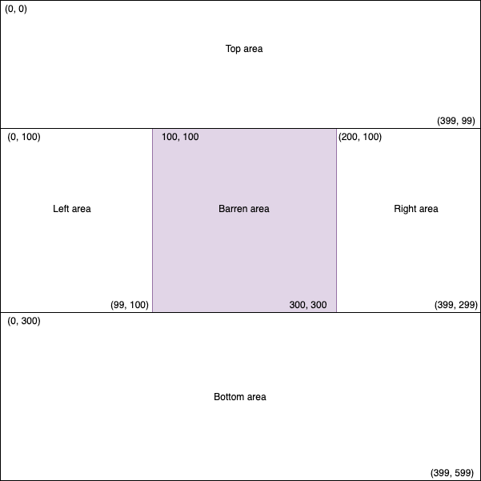

 # Barren Land Analysis

### **Case Study Selection Motivation**
As a developer I have built apps with both SOA or Search capabilities. It would have been relatively easy to 
spin up a ReSTful service using SpringBoot or implement search with search engine like Lucene. I have always 
loved to write algorithms that can help solve problems. I think this problems lets me showcase my skills the best,
without hiding behind frameworks, which is why I naturally gravitated toward this problem.

##### **Problem statement**

You have a farm of 400m by 600m where coordinates of the field are from (0, 0) to (399, 599). A portion of the farm is 
barren, and all the barren land is in the form of rectangles. Due to these rectangles of barren land, the remaining area of 
fertile land is in no particular shape. An area of fertile land is defined as the largest area of land that is not covered by 
any of the rectangles of barren land.

Read input from STDIN. Print output to STDOUT  

###### **Input** :
You are given a set of rectangles that contain the barren land. These rectangles are defined in a string, which consists of four 
integers separated by single spaces, with no additional spaces in the string. The first two integers are the coordinates of the 
bottom left corner in the given rectangle, and the last two integers are the coordinates of the top right corner.

###### **Output**
Output all the fertile land area in square meters, sorted from smallest area to greatest, separated by a space.

    
 | Sample Input | Sample Output           |          
 | ------------- |:-------------:|      
 | {“0 292 399 307”} | 116800  116800 |             
 | {“48 192 351 207”, “48 392 351 407”, “120 52 135 547”, “260 52 275 547”} | 22816 192608       |          
  
#### System Requirements:
1. Any system with Java 1.8

#### Conceptualization:
My intial thought was to utilizes a BFS/Flood Fill/Forest Fire algorithm to detect fertile land. After analysing 
the space time complexity I decided against it. This solution has a complexity of n where n is the number of 
barren patches. The approach is as below:

 1. Algorithm starts with the assumption that all land is fertile and there is just one patch.
 2. As the first barren patch is introduced it splits the farm into 4 fertile and 1 barren patch.
 3. The patches are top, bottom, left and right
 4. As more barren patches are introduced the existing paths continue to split as they may contain 
    the barren patch or partially overlap with it.
 5. When all barren patches are accounted for. The algorithm determines islands of contiguous patches.
 6. Sum of area of all contiguous patches is then summed, stored and returned.
  


#### Complexity:
BFS/Flood Fill/Forest Fire algorithm would require space to save (400 X 600) points and multiple iterations 
over the space. 

With the algorithm presented the space would track rectangles and iterate over the rectangles. Algorithms time 
and space complexity will vary with number or infertile areas.
 
 ### Installing Application

A step by step series of examples that tell you how to get a development env running in local machine

1. Clone the repo from GitHub using gitcli command,

```
git clone https://github.com/niveaM/BarrenLandAnalysis.git
```

2. Build the application
```
mvn clean install (runs junit tests)
mvn clean install -DskipTests (to ignore/ skip junits)
```

3. Run the Application from command line
```
java -jar target/BarrenLandAnalysis-1.0-SNAPSHOT.jar  "{“48 192 351 207”, “48 392 351 407”, “120 52 135 547”, “260 52 275 547”}"
```
 
### Built With

* [Maven](https://maven.apache.org/) - Dependency Management


### Authors & Contributing

* **Nivea Mandavia**